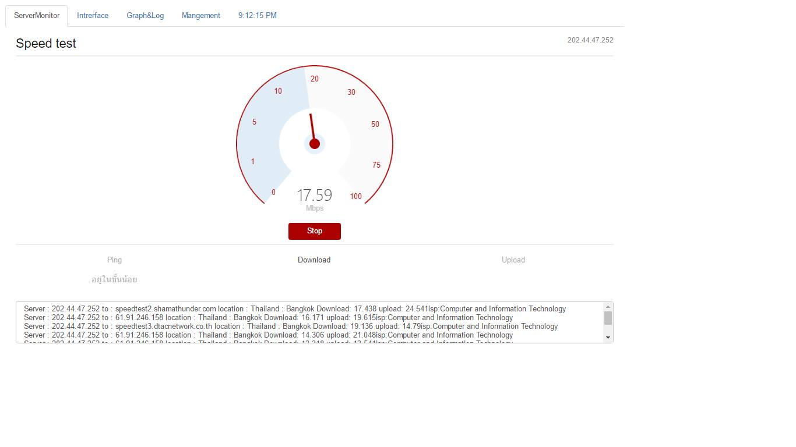

# <center>Angry Monitor</center>
<center>[](screen.png)</center>
 [](http://standardjs.com/)

A code powered program built with AngularJS.


## Monitor (run)

node index.js (localhost)

## Install Monitor

```
$ git clone https://github.com/infernalslam/snmp-Node.js.git
$ node index.js
```
```
update 
1. Show all switch/router 
(if device on snmp, I will pass require snmp protocol)
2. Check fastinterface/gigabitinterface
3. Chartjs.org Download/Upload
4. SpeedTest internet
```
## FAQ

Q:  <i><u>ทำไมต้องเขียนด้วย AngularJS ไม่เขียนไม่ได้หรอ ?</u><i><br> 
A:  เพราะสมัยนี้เราเก็บข้อมูลเป็น JSON ซึ่งไม่ใช่ SQL กระจอกๆ <br> มันทำให้เราสร้างหรือเรียกได้ทันทีโดยไม่ต้องเขียน code เพิ่มขึ้นและ <br> มีภาษาหลาย ๆ ภาษาที่รองรับการใช้งาน JSON <br>
<br><br>
Q: <i><u>ทำไมไม่เก็บ LOG FILE ?</i></u><br>
A: เพราะเราไม่ได้ตั้ง server ภายในองศ์กร ถ้าหากติดตั้งในองศ์กร<br> อาจจะมีความยุ่งยากเเละเนื่องด้วยเวลาเเละถ้าหากติดตั้ง server<br> ต้องติดตั้งหลายๆ เพื่อเก็บ log สำหรับวงอื่นๆ เราจึงใช้ Nodejs<br> เข้ามาช่วยเพื่อให้สามารถทำให้เครื่องคุณที่รัน code นี้ทำงานได้เลยโดยไม่ต้องยุ่งกับ server <br>หลักเปรียบเหมือนตัวเองเป็น server เลย <br><br>
Q: <i><u>วัดค่าความเร็วเน็ตอย่างไง ?</i></u><br>
A: วัดจากการส่ง package ไปยัง API เว็บต่างๆ เพื่อรอ response กลับมา <br><br>
Q: <i><u>ทำไมมันดึงค่าของ MAC ADDRESS ไม่ได้?</i></u><br> 
A: HTTP อยู่ในชั้นของ Application Layer ส่วน MAC Address อยู่ชั้น Data Link มัน<br>
เลยดึงไม่ได้อยู่เเล้ว ยิ่งข้ามวงหมดสิทธิ์ เพราะเลข MAC Address <br> จะเปลี่ยนทุครั้งที่ข้าม HOP เเต่เราสามารถดึงได้เเค่วงที่ตัวเองต่อเท่านั้นครับ <br>
ยกตัวอย่างเช่น ARP 
<br><br>

Q: <i><u>แล้วมันมีประโยชน์อย่างไงกับระบบ ?</i></u><br>
A: เราสามารถรู้ว่า port ไหน DOWN ได้จากการดู monitor จากเว็บเรา

## THANK YOU


## Features

